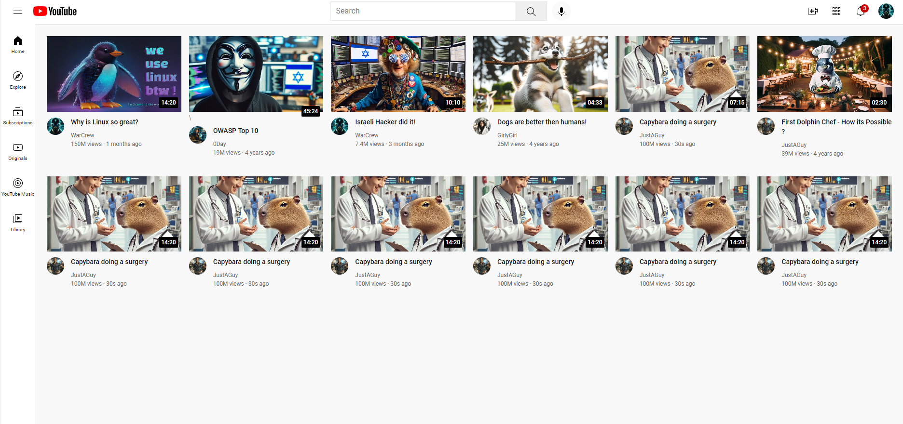

# HTML-CSS-YoutubeClone# YouTube Clone

This repository contains code for a YouTube clone.

## Description

This project aims to replicate the core functionalities of YouTube, including video browsing, searching, and playback.

## Features

- Responsive design for various screen sizes.
- Search functionality for finding specific videos.
- Explore section for discovering new content.
- Subscription feature to follow favorite channels.
- Originals section for curated content.
- Integration with YouTube Music.
- Library section for managing saved videos.
- Video thumbnails and metadata display.
- User profile pictures for video authors.
- Video playback with duration information.

## Technologies Used

- HTML
- CSS

